# Desenvolvimento de Apps CrossPlataform com **Kivy** e **Python**

---

# Daniel Pimentel (d4n1)

- Especialista em Engenharia de Software
- Graduado em Análise e Desenvolvimento de Sistemas
- Técnico em Projetos e Administração de Redes
- Técnico em Projetos e Análise de Sistemas
- LPIC (Linux Professional Institute Certified) 
- NCLA (Novel Certified Linux Administrator)
- Desenvolvedor Open Source (Python, C/C++, HTML, CSS, ...)
- SysAdmin Open Source (GNU/Linux, GNU/Hurd, BSD)
- Entusiasta por Open Design (Gimp, Inkscape, Blender, ...)
- Entusiasta por Open Hardware (Arduino, Raspberry Pi, ...)
- Hacktivista

---

# Apps

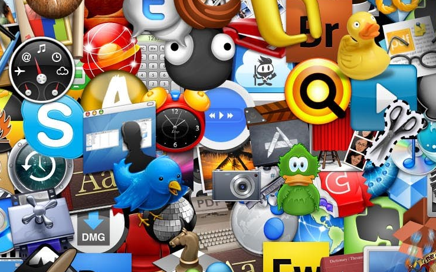

---

# Principais plataformas mobile

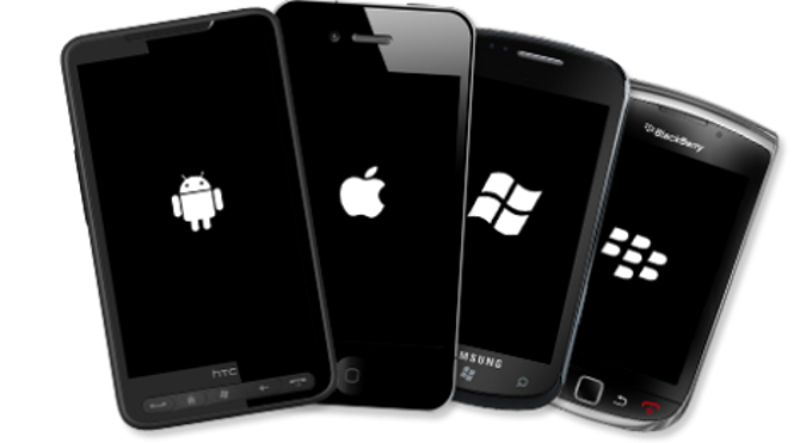

---

# Algumas tecnologias

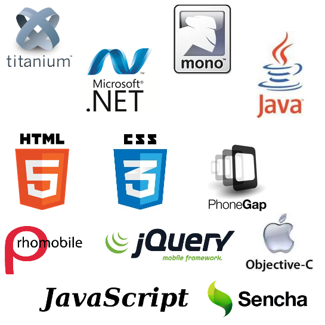

---

# Alguns Frameworks mobile

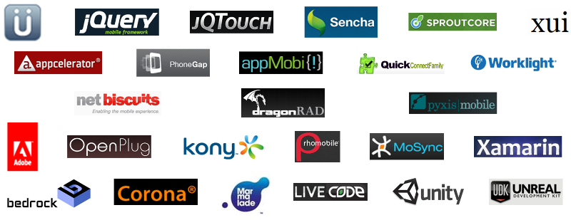

---

# Python mobile?

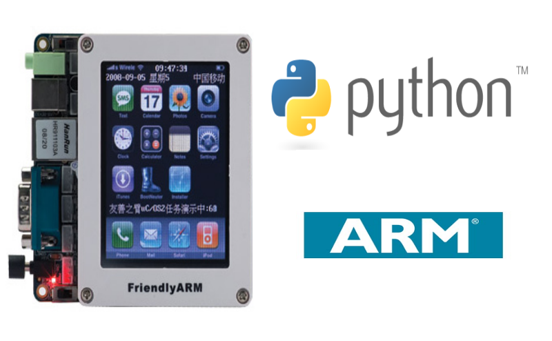

---

# Script Layer For Android (SL4A)

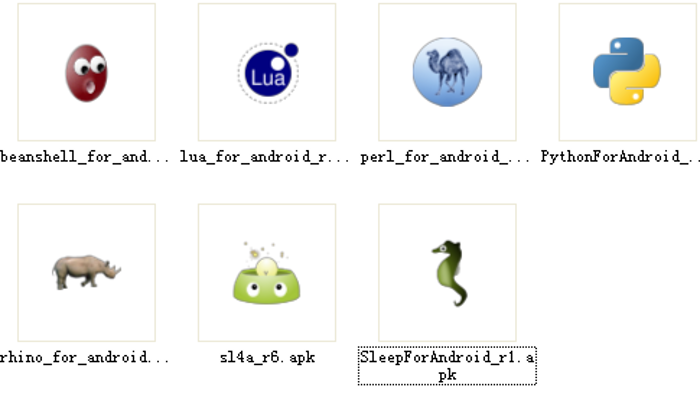

---

# Kivy

---

# Apps Cross-Plataform com Python e Kivy

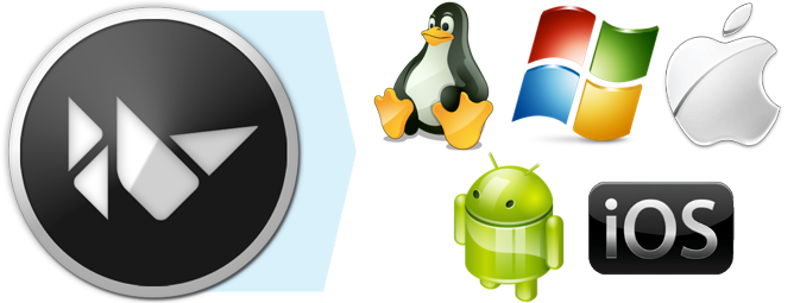

---

# Kivy + Raspberry Pi

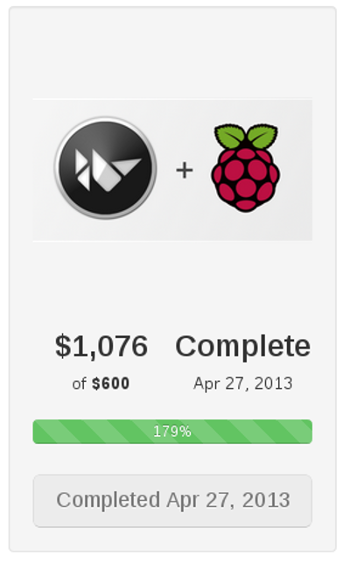

---

# Criado do zero (**Multi-Touch**)

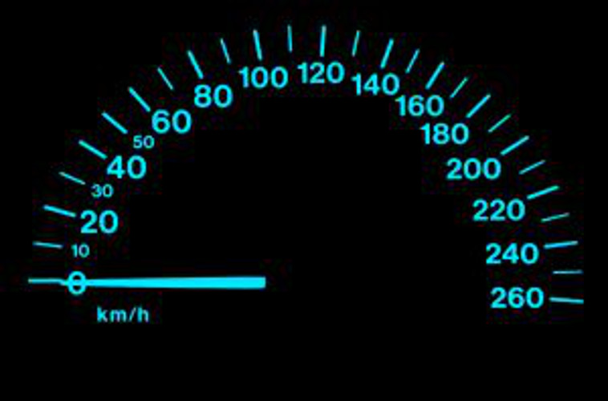

---

# Alto desempenho (**GPU** + C)

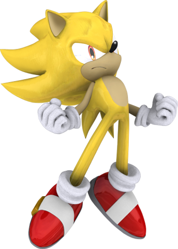

---

# Desenvolvimento rápido (**Python** + **Kivy**)

---

# Kivy é Livre (MIT licence)!

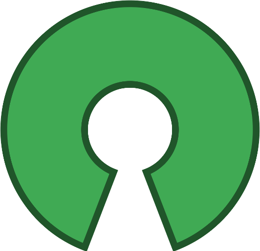

---

# Requisitos para instalação

Obrigatórios

- **Python 2.x (2.6 <= x < 3.0)**
- **Cython**
- Pygame
- Gst-Python
- Enchant

Opcionais

- OpenCV 2.0 (Camera input)
- PIL (Image and text display)
- PyCairo (Text display)
- PyEnchant (Spelling correction)
- PyGST (Audio/video playback and camera input).

---

# Instalação no GNU/Linux (Debian)

Adicionando o repositório (stable)

    !bash
    sudo echo deb http://ppa.launchpad.net/kivy-team/kivy/ubuntu oneiric main >> /etc/apt/sourcelist

Adicionando o repositório (unstable)

    !bash
    sudo echo deb http://ppa.launchpad.net/kivy-team/kivy-daily/ubuntu oneiric main >> /etc/apt/sourcelist

Adicionando a chave GPG

    !bash
    sudo apt-key adv –keyserver keyserver.ubuntu.com –recv-keys A863D2D6

Instalação

    !bash
    sudo aptitude update
    sudo aptitude install python-kivy
    sudo aptitude install python-kivy-examples

Disponível para Linux, MacOSX, Windows, Android e IOS, inclusive via **PIP**

- [http://kivy.org/#download](http://kivy.org/#download)

---

# Widgets

- **Widgets básicos**: Label,  Button, CheckBox, Image, Slider, Progress Bar, Text Input, Toggle Button, Switch, Video
- **Widgets de layout**: Grid Layout, Box Layout, Anchor Layout, Stack Layout
- **Widgets UX complexos**: Bubble, Drop-Down List, FileChooser, Popup, Spinner, TabbedPanel, Video Player, VKeyboard
- **Widgets de comportamento**: Scatter, Stencil View
- **Widgets de gerenciamento de tela**: Screen Manager 

---

# Hello Python Brasil

Criando o arquivo hello.py
    
    !bash
    touch hello.py 

Editando o arquivo hello.py

    !python
    from kivy.app import App
    from kivy.uix.button import Button

    class HelloPythonBrasil(App):
        def build(self):
            return Button(text='Hello Python Brasil')

    HelloPythonBrasil().run()

Executando a aplicação Kivy

    !bash
    sudo python hello.py

---

# Jogo Pong

Criando os arquivos main.py e pong.kv

    !bash
    touch main.py
    touch pong.kv

---

# Jogo Pong

Editando o arquivo main.py

    !python
    from kivy.app import App
    from kivy.uix.widget import Widget
    from kivy.properties import NumericProperty, ReferenceListProperty,\
        ObjectProperty
    from kivy.vector import Vector
    from kivy.clock import Clock

    class PongPaddle(Widget):
        score = NumericProperty(0)

        def bounce_ball(self, ball):
            if self.collide_widget(ball):
                vx, vy = ball.velocity
                offset = (ball.center_y - self.center_y) / (self.height / 2)
                bounced = Vector(-1 * vx, vy)
                vel = bounced * 1.1
                ball.velocity = vel.x, vel.y + offset

    class PongBall(Widget):
        velocity_x = NumericProperty(0)
        velocity_y = NumericProperty(0)
        velocity = ReferenceListProperty(velocity_x, velocity_y)

        def move(self):
            self.pos = Vector(*self.velocity) + self.pos

    class PongGame(Widget):
        ball = ObjectProperty(None)
        player1 = ObjectProperty(None)
        player2 = ObjectProperty(None)

        def serve_ball(self, vel=(4, 0)):
            self.ball.center = self.center
            self.ball.velocity = vel

        def update(self, dt):
            self.ball.move()

            #bounce of paddles
            self.player1.bounce_ball(self.ball)
            self.player2.bounce_ball(self.ball)

            #bounce ball off bottom or top
            if (self.ball.y < self.y) or (self.ball.top > self.top):
                self.ball.velocity_y *= -1

            #went of to a side to score point?
            if self.ball.x < self.x:
                self.player2.score += 1
                self.serve_ball(vel=(4, 0))
            if self.ball.x > self.width:
                self.player1.score += 1
                self.serve_ball(vel=(-4, 0))

        def on_touch_move(self, touch):
            if touch.x < self.width / 3:
                self.player1.center_y = touch.y
            if touch.x > self.width - self.width / 3:
                self.player2.center_y = touch.y

    class PongApp(App):
        def build(self):
            game = PongGame()
            game.serve_ball()
            Clock.schedule_interval(game.update, 1.0 / 60.0)
            return game

    if __name__ == '__main__':
        PongApp().run()

---

# Jogo Pong

Editando o arquivo pong.kv

    !python
    #:kivy 1.5.1
    
    <PongBall>:
        size: 50, 50 
        canvas:
            Ellipse:
                pos: self.pos
                size: self.size          

    <PongPaddle>:
        size: 25, 200
        canvas:
            Rectangle:
                pos:self.pos
                size:self.size

    <PongGame>:
        ball: pong_ball
        player1: player_left
        player2: player_right
        
        canvas:
            Rectangle:
                pos: self.center_x-5, 0
                size: 10, self.height
        
        Label:
            font_size: 70  
            center_x: root.width / 4
            top: root.top - 50
            text: str(root.player1.score)
            
        Label:
            font_size: 70  
            center_x: root.width * 3 / 4
            top: root.top - 50
            text: str(root.player2.score)
        
        PongBall:
            id: pong_ball
            center: self.parent.center
            
        PongPaddle:
            id: player_left
            x: root.x
            center_y: root.center_y
            
        PongPaddle:
            id: player_right
            x: root.width-self.width
            center_y: root.center_y

---

# Jogo Pong

Executando o jogo Pong

    !bash
    sudo python main.py

---

# App Paint

Criando o arquivo main.py

    !bash
    touch main.py

---

# App Paint

Editando o arquivo main.py

    !python
    from random import random
    from kivy.app import App
    from kivy.uix.widget import Widget
    from kivy.uix.button import Button
    from kivy.graphics import Color, Ellipse, Line

    class MyPaintWidget(Widget):

        def on_touch_down(self, touch):
            color = (random(), 1, 1)
            with self.canvas:
                Color(*color, mode='hsv')
                d = 30.
                Ellipse(pos=(touch.x - d / 2, touch.y - d / 2), size=(d, d))
                touch.ud['line'] = Line(points=(touch.x, touch.y))

        def on_touch_move(self, touch):
            touch.ud['line'].points += [touch.x, touch.y]

    class MyPaintApp(App):

        def build(self):
            parent = Widget()
            painter = MyPaintWidget()
            clearbtn = Button(text='Clear')
            parent.add_widget(painter)
            parent.add_widget(clearbtn)

            def clear_canvas(obj):
                painter.canvas.clear()
            clearbtn.bind(on_release=clear_canvas)

            return parent

    if __name__ == '__main__':
        MyPaintApp().run()

---

# App Paint

Executando a app Paint

    !bash
    sudo python main.py

---

# Kivy-Designer

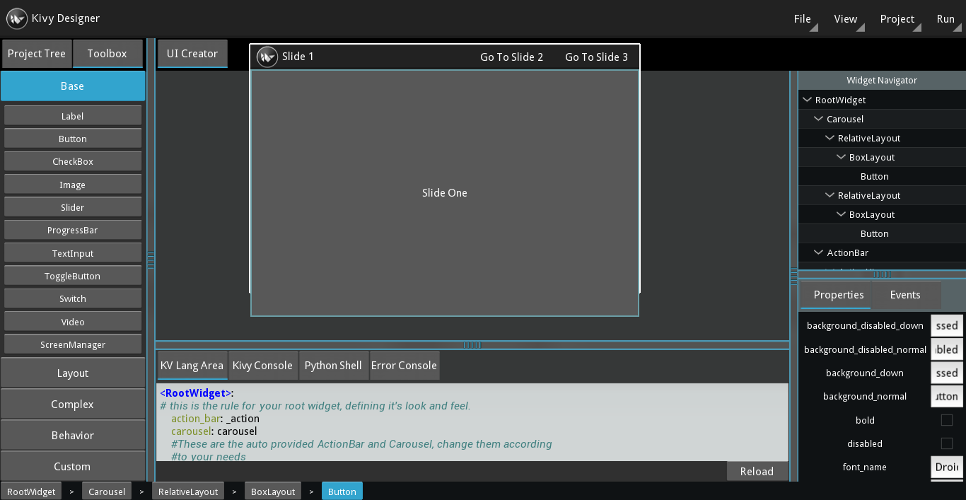

---

# Compilando para Android (APK)

Dependências

- GNU/Linux 
- Java, 
- **Python == 2.7** 
- **Jinja2** 
- Apache ant
- Android SDK

Setup inicial

- http://python-for-android.readthedocs.org/en/latest/prerequisites/
    
Guia de instalação

- http://kivy.org/docs/guide/packaging-android.html

---

# Alternativas pythônicas (QPython)

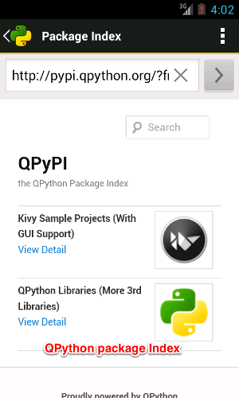

---

# That's all folks!
